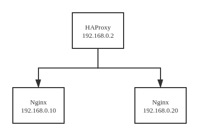

# HTTP 代理示例

## 架构图



## 创建测试环境

创建网络

```
docker network create --subnet=192.168.0.0/16 staticnet
```

创建容器

```
docker run -d -v /www/web:/www/web --name haproxy-master --net staticnet --ip 192.168.0.2 phpdev
docker run -d -v /www/web:/www/web --name nginx-node1 --net staticnet --ip 192.168.0.10 phpdev
docker run -d -v /www/web:/www/web --name nginx-node2 --net staticnet --ip 192.168.0.20 phpdev
```

## 配置 haproxy-master 

创建代理配置 example01.cfg

```
defaults
    mode http
    option httplog
    log /dev/log local0 debug
    timeout connect 1000ms
    timeout client 1000ms
    timeout server 1000ms

listen http-server
    bind :80
    mode http

    acl is-foo hdr_dom(host) -i foo.com
    acl is-bar hdr_dom(host) -i bar.com

    use_backend backend-foo if is-foo
    use_backend backend-bar if is-bar

    default_backend backend-no-match

backend backend-foo
    server server1 192.168.0.10:80

backend backend-bar
    server server1 192.168.0.20:80

backend backend-no-match
    http-request deny deny_status 400
```

启动 haproxy

```
haproxy -f example01.cfg
```

观察日志

```
tail -f /var/log/haproxy.log
```

## 配置 nginx-node1

创建 foo.com 站点配置

```
server {
	listen 80;
	server_name foo.com www.foo.com;

	index index.html index.htm;
	root /www/web/foo.com;

	location / {
		try_files $uri $uri/ =404;
	}
}
```

### 其他

为了观察日志，可以给日志加上 `$http_host`

```
log_format  main  '$remote_addr - $remote_user [$time_local] "$request" '
  '$status $body_bytes_sent "$http_referer" '
  '"$http_user_agent" "$http_x_forwarded_for" [$http_host]';
```

观察日志

```
tail -f /var/log/nginx/access.log
```

以上步骤同样适用于 nginx-node2

## 配置 nginx-node2

创建 bar.com 站点配置

```
server {
	listen 80;
	server_name bar.com www.bar.com;
	
	index index.html index.htm;
	root /www/web/bar.com;

	location / {
		try_files $uri $uri/ =404;
	}
}
```

## 测试代理功能

主机 hosts 添加以下记录

```
192.168.0.2 foo.com
192.168.0.2 www.foo.com
192.168.0.2 bar.com
192.168.0.2 www.bar.com
192.168.0.2 notfound.com
192.168.0.2 www.notfound.com
```

测试代理功能是否正常

```
curl http://foo.com
curl http://www.foo.com
curl http://bar.com
curl notfound.com
```

观察 haproxy-master、nginx-node1、nginx-node2 的日志以及页面输出，判断代理是否工作正常。

## 参考

- [Web Service Fronting](https://gist.github.com/mhofman/a01df56480b3791d526b77dbebef43a2)
- [HAProxy: Routing by domain name](https://timogin.com/haproxy-routing-by-domain-name-4e1ff877cc42)
- [How to stop requests with empty or incorrect host header](https://blog.sleeplessbeastie.eu/2020/01/13/how-to-stop-requests-with-empty-or-incorrect-host-header/)
- [docker设置容器固定ip](https://blog.csdn.net/wanghao_0206/article/details/79583325)
