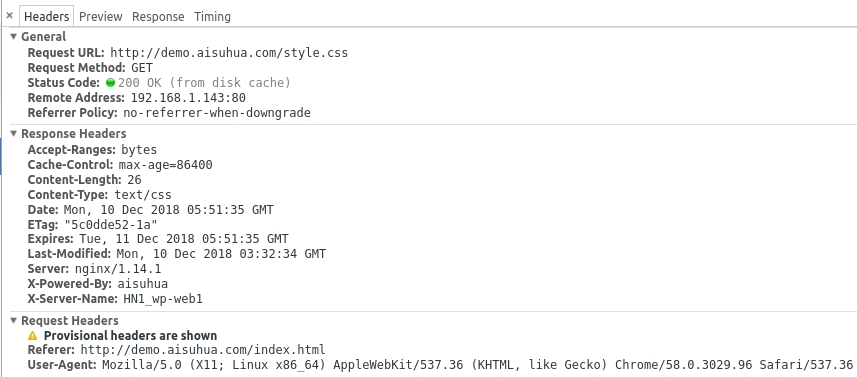
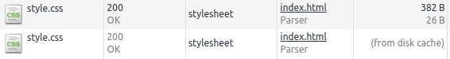

# HTTP Cache Headers

## 强缓存

无须验证的缓存策略，主要利用 `Expires` 和 `Cache-Control` 两个响应头来实现。

其中 `Expires` 是 HTTP 1.0 版本的产物，现在只做兼容作用。

### 首次请求 style.css

```
GET /style.css HTTP/1.1
Host: demo.aisuhua.com
Connection: keep-alive
Pragma: no-cache
Cache-Control: no-cache
User-Agent: Mozilla/5.0 (X11; Linux x86_64) ...
Accept: text/css,*/*;q=0.1
Referer: http://demo.aisuhua.com/index.html
Accept-Encoding: gzip, deflate, sdch
Accept-Language: zh-CN,zh;q=0.8,en;q=0.6

HTTP/1.1 200 OK
Server: nginx/1.14.1
Date: Mon, 10 Dec 2018 05:51:35 GMT
Content-Type: text/css
Content-Length: 26
Last-Modified: Mon, 10 Dec 2018 03:32:34 GMT
Connection: keep-alive
ETag: "5c0dde52-1a"
Expires: Tue, 11 Dec 2018 05:51:35 GMT
Cache-Control: max-age=86400
X-Powered-By: aisuhua
X-Server-Name: HN1_wp-web1
Accept-Ranges: bytes

body {
    backgroud: #eee;
}
```

服务器告知浏览器 24 小时内可直接读取本地缓存而无需再次发起请求。

```
Expires: Tue, 11 Dec 2018 05:51:35 GMT
Cache-Control: max-age=86400
```

### 第二次请求 style.css



浏览器没有向服务器发起请求，而是直接读取本地缓存。



## 协商缓存

若服务器上的文件发生了修改，「强缓存」不会即时获取最新的内容，因为只要缓存还没有过期，浏览器就会一直使用本地缓存。若要让浏览器重新获取该文件内容，可以在引入静态资源时加上版本号，比如：

```html
<link rel="stylesheet" href="style.css?v=1">
```

而协商缓存每次都会向服务器校验当前文件是否发生变化，若服务器判断文件已发生修改，则返回最新的文件内容，否则只响应 `304 Not Modified`。 这种方式能保证浏览器渲染的内容永远是最新的，但是它的速度会慢一些，因为产生多了一次请求。

响应头

```
Last-Modified
ETag
```

请求头

```
If-None-Match
If-Modified-Since
```

### 首次请求 index.html

```
GET /index.html HTTP/1.1
Host: demo.aisuhua.com
Connection: keep-alive
Pragma: no-cache
Cache-Control: no-cache
Upgrade-Insecure-Requests: 1
User-Agent: Mozilla/5.0 (X11; Linux x86_64) ...
Accept-Encoding: gzip, deflate, sdch
Accept-Language: zh-CN,zh;q=0.8,en;q=0.6

HTTP/1.1 200 OK
Server: nginx/1.14.1
Date: Mon, 10 Dec 2018 05:51:35 GMT
Content-Type: text/html
Content-Length: 102
Last-Modified: Mon, 10 Dec 2018 03:33:23 GMT
Connection: keep-alive
ETag: "5c0dde83-66"
X-Powered-By: aisuhua
X-Server-Name: HN1_wp-web1
Accept-Ranges: bytes

<html>
<link rel="stylesheet" href="style.css">
<body>
<center><h1>demo</h1></center>
</body>
</html>
```

服务器告知浏览器该文件的 hash 和最近一次的修改时间，浏览器会将这两个值存储起来，之后用于校验文件是否过期。

```
Last-Modified: Mon, 10 Dec 2018 03:33:23 GMT
ETag: "5c0dde83-66"
```

### 第二次请求 index.html

```
GET /index.html HTTP/1.1
Host: demo.aisuhua.com
Connection: keep-alive
Cache-Control: max-age=0
Upgrade-Insecure-Requests: 1
User-Agent: Mozilla/5.0 (X11; Linux x86_64) ...
Accept-Encoding: gzip, deflate, sdch
Accept-Language: zh-CN,zh;q=0.8,en;q=0.6
If-None-Match: "5c0dde83-66"
If-Modified-Since: Mon, 10 Dec 2018 03:33:23 GMT

HTTP/1.1 304 Not Modified
Server: nginx/1.14.1
Date: Mon, 10 Dec 2018 05:52:13 GMT
Last-Modified: Mon, 10 Dec 2018 03:33:23 GMT
Connection: keep-alive
ETag: "5c0dde83-66"
X-Powered-By: aisuhua
X-Server-Name: HN1_wp-web1
```

浏览器询问服务器文件的 hash 值是否一致或者文件是否发生过修改。

```
If-None-Match: "5c0dde83-66"
If-Modified-Since: Mon, 10 Dec 2018 03:33:23 GMT
```

当文件没有发生修改时，服务器不返回内容并响应 304 状态码。浏览器收到 304 状态码后就会读取本地缓存。

```
HTTP/1.1 304 Not Modified
```

若文件发生变化，服务器会返回最新的文件内容并响应 200 状态码，此时浏览器会更新本地缓存。

```
HTTP/1.1 200 OK
Server: nginx/1.14.1
Date: Mon, 10 Dec 2018 07:16:39 GMT
Content-Type: text/html
Content-Length: 103
Last-Modified: Mon, 10 Dec 2018 07:16:32 GMT
Connection: keep-alive
ETag: "5c0e12d0-67"
X-Powered-By: aisuhua
X-Server-Name: HN1_wp-web1
Accept-Ranges: bytes

<html>
<-- add a new line -->
<link rel="stylesheet" href="style.css">
<body>
<center><h1>demo</h1></center>
</body>
</html>
```
