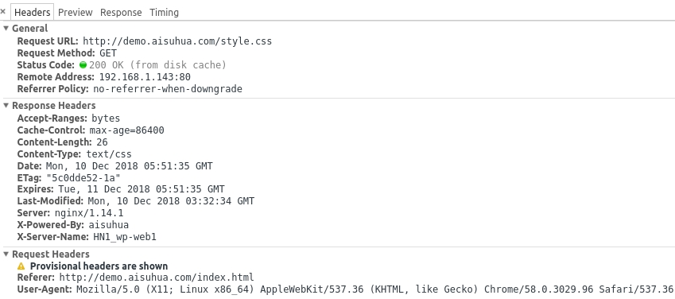

# HTTP Cache Headers

## 强缓存

无须验证的缓存策略，主要利用 `Expires` 和 `Cache-Control` 两个响应头来实现。

其中 `Expires` 是 HTTP 1.0 版本的产物。

### 首次请求 style.css

```
GET /style.css HTTP/1.1
Host: demo.aisuhua.com
Connection: keep-alive
Pragma: no-cache
Cache-Control: no-cache
User-Agent: Mozilla/5.0 (X11; Linux x86_64) ...
Accept: text/css,*/*;q=0.1
Referer: http://demo.aisuhua.com/index.html
Accept-Encoding: gzip, deflate, sdch
Accept-Language: zh-CN,zh;q=0.8,en;q=0.6

HTTP/1.1 200 OK
Server: nginx/1.14.1
Date: Mon, 10 Dec 2018 05:51:35 GMT
Content-Type: text/css
Content-Length: 26
Last-Modified: Mon, 10 Dec 2018 03:32:34 GMT
Connection: keep-alive
ETag: "5c0dde52-1a"
Expires: Tue, 11 Dec 2018 05:51:35 GMT
Cache-Control: max-age=86400
X-Powered-By: aisuhua
X-Server-Name: HN1_wp-web1
Accept-Ranges: bytes

body {
    backgroud: #eee;
}
```

首次请求 style.css 文件时，服务器告知浏览器 24 小时内可直接读取缓存而无需再次发起请求。

```
Expires: Tue, 11 Dec 2018 05:51:35 GMT
Cache-Control: max-age=86400
```

### 第二次请求 style.css



第二次请求 style.css 时，浏览器没有向服务器发起请求，而是直接读取本地缓存。


