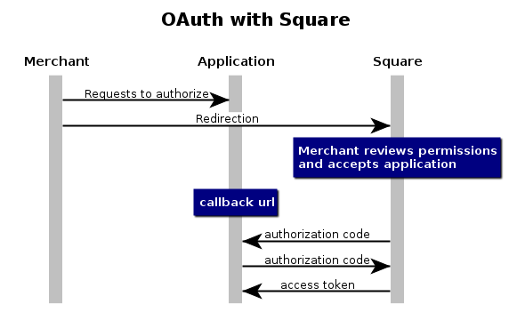
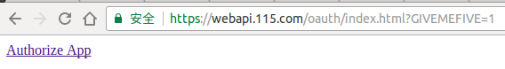
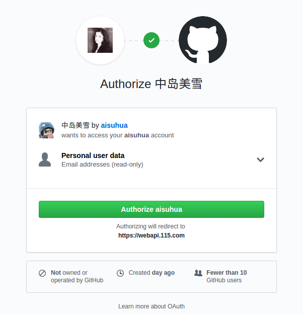

# OAuth

OAuth is an open standard for access delegation, commonly used as a way for Internet users to grant websites or applications access to their information on other websites but without giving them the passwords.
This mechanism is used by companies such as Amazon,Google, Facebook, Microsoft and Twitter to permit the users to share information about their accounts with third party applications or websites.

让用户可以在不提供帐号密码给第三方网站的情况下，授权第三方网站访问他的个人信息。

- [OAuth](https://en.wikipedia.org/wiki/OAuth)

## 原理图



At its core, OAuth requires you to redirect users to a special URL on Square’s site that includes your application id. 
The merchant then decides whether or not to allow your application access, and which permissions your app will have. 
You application then gets an authorization code, which it will exchange for an access token with an authenticated request.

- [OAuth with PHP, Part One: getting access tokens.](https://medium.com/square-corner-blog/oauth-with-php-part-one-getting-access-tokens-5a18b0b70099)

## 示例

OAuth 定义了四种角色

- 资源拥有者 (Resource Owner) 用户 aisuhua
- 客户端 (Client) webapi.115.com
- 授权服务器 (Authorization Server) github.com
- 资源服务器 (Resource Server) github.com


### 交互过程

用户点击客户端提供的授权请求按钮



```html
<a href="https://github.com/login/oauth/authorize?client_id=CLIENT_ID&response_type=code&
scope=user:email&redirect_uri=https://webapi.115.com/oauth/callback.php">Authorize App</a>
```

- [Authorizing OAuth Apps](https://developer.github.com/apps/building-oauth-apps/authorizing-oauth-apps/)

进入授权询问页面



用户点击确认授权后服务端返回授权许可凭证 authorization code 给客户端

```
https://webapi.115.com/oauth/callback.php?code=7d539c86c74b32f17b39
```

客户端使用 authorization code 和 client secret 等信息获取 access token

```php
$client_id = '';
$client_secret = '';
$authorization_code = $_GET['code'];
$url = 'https://github.com/login/oauth/access_token';

$data = array(
    'client_id' => $client_id,
    'client_secret' => $client_secret,
    'code' => $authorization_code
);

$options = array(
    'http' => array(
        'header'  => "Content-type: application/json\r\n",
        'method'  => 'POST',
        'content' => json_encode($data)
    )
);

$context  = stream_context_create($options);
$result = file_get_contents($url, false, $context);
var_dump($result);
```

客户端通过获取到的 access token 请求服务端获取资源。

```php
$access_token = json_decode($result)->access_token;

$url = 'https://api.github.com/user';
$options = array(
    'http'=> array(
        'method'=> 'GET',
        'header'  => array(
            "Authorization: token {$access_token}",
            "Accept: application/json",
            "User-Agent: aisuhua"
        )
    )
);

$context = stream_context_create($options);
$result = file_get_contents($url, false, $context);

$email = json_decode($result)->email;
var_dump($email);
```


## 参考文献

- [OAuth with PHP, Part One: getting access tokens.](https://medium.com/square-corner-blog/oauth-with-php-part-one-getting-access-tokens-5a18b0b70099)
- [OAuth with PHP Part Two: refreshing & revoking tokens](https://medium.com/square-corner-blog/oauth-with-php-part-two-refreshing-revoking-tokens-9ae065537c41)
- [OAuth 2 详解](https://zhuanlan.zhihu.com/p/30720675)


