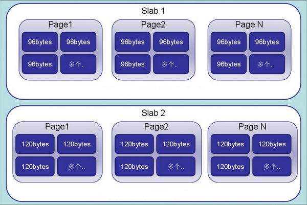

# Memcached

Memcached 作为高速运行的分布式缓存服务器，具有以下的特点：

- 协议简单
- 基于 libevent 的事件处理
- 内置内存存储方式
- Memcached 不互相通信的分布式

## 安装

安装

```sh
wget http://memcached.org/files/memcached-1.5.12.tar.gz
tar -zxvf memcached-1.5.12.tar.gz
cd memcached-1.5.12
./configure
make
make test
make install
```

启动

```sh
memcached -p 11211 -m 64 -vv -u root
```

- [Installation](https://memcached.org/downloads)

## Slab Allocation 内存分配机制

在启动时可设置 Growth Factor 因子，以控制每个 Slab 之间的大小间隙。

```sh
memcached -p 11211 -m 64 -vv -u root -f 1.25
```

其原理如下图：



