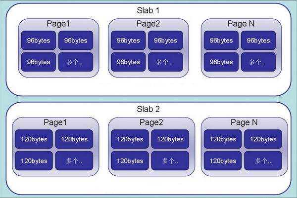
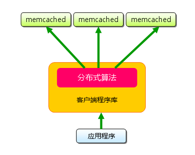

# Memcached

Memcached 作为高速运行的分布式缓存服务器，具有以下的特点：

- 协议简单
- 基于 libevent 的事件处理
- 内置内存存储方式
- Memcached 不互相通信的分布式

## 安装

安装

```sh
wget http://memcached.org/files/memcached-1.5.12.tar.gz
tar -zxvf memcached-1.5.12.tar.gz
cd memcached-1.5.12
./configure
make
make test
make install
```

启动

```sh
memcached -p 11211 -m 64 -vv -u root
```

- [Installation](https://memcached.org/downloads)

## Slab Allocation 内存分配机制



- Memcached 在启动时就将内存空间划分为多个 Slab (Class)；
- 每个 Slab 由多个 Page 组成，每个 Page 的大小默认为 1M；
  - 初始时每个 Slab 只有一个 Page，当该 Page 空间被用完后会再继续申请下一个 Page；
- 每个 Page 包含若干个固定大小的 Chunk，Chunk 就是数据存储的地方；
- Growth Factor 因子是用于设置不同的 Slab 之间的 Chunk 的大小间隙，以满足存储不同大小片段的数据。

```sh
shell> memcached -p 11211 -m 64 -vv -u root
slab class   1: chunk size        96 perslab   10922
slab class   2: chunk size       120 perslab    8738
slab class   3: chunk size       152 perslab    6898
slab class   4: chunk size       192 perslab    5461
slab class   5: chunk size       240 perslab    4369
slab class   6: chunk size       304 perslab    3449
slab class   7: chunk size       384 perslab    2730
slab class   8: chunk size       480 perslab    2184
slab class   9: chunk size       600 perslab    1747
slab class  10: chunk size       752 perslab    1394
slab class  11: chunk size       944 perslab    1110
slab class  12: chunk size      1184 perslab     885
slab class  13: chunk size      1480 perslab     708
slab class  14: chunk size      1856 perslab     564
slab class  15: chunk size      2320 perslab     451
slab class  16: chunk size      2904 perslab     361
slab class  17: chunk size      3632 perslab     288
slab class  18: chunk size      4544 perslab     230
slab class  19: chunk size      5680 perslab     184
slab class  20: chunk size      7104 perslab     147
slab class  21: chunk size      8880 perslab     118
slab class  22: chunk size     11104 perslab      94
slab class  23: chunk size     13880 perslab      75
slab class  24: chunk size     17352 perslab      60
slab class  25: chunk size     21696 perslab      48
slab class  26: chunk size     27120 perslab      38
slab class  27: chunk size     33904 perslab      30
slab class  28: chunk size     42384 perslab      24
slab class  29: chunk size     52984 perslab      19
slab class  30: chunk size     66232 perslab      15
slab class  31: chunk size     82792 perslab      12
slab class  32: chunk size    103496 perslab      10
slab class  33: chunk size    129376 perslab       8
slab class  34: chunk size    161720 perslab       6
slab class  35: chunk size    202152 perslab       5
slab class  36: chunk size    252696 perslab       4
slab class  37: chunk size    315872 perslab       3
slab class  38: chunk size    394840 perslab       2
slab class  39: chunk size    524288 perslab       2
<26 server listening (auto-negotiate)
<27 server listening (auto-negotiate)
```

Memcached 把 slab 分为 39 类（class1 ～ class39），在 class1 中，每个 chunk 的大小为 96 字节，由于一个 slab page 的大小固定的 1048576 字节（1M），应此在 class1 中最多可以有 10922 个 chunk，剩余的 64 字节因为不够一个 chunk 的大小，因此会被浪费掉。

```math
10922 x 96 + 64 = 1048576
```

每类 chunk 的大小有一定的计算公式，假定 i 代表分类，class i 的计算公式如下：

```math
chunk size(class i) = (default_size + item_size) * f^(i-1) + CHUNK_ALIGN_BYTES
```

- default_size 默认为 48 字节,也就是默认的 key + value 大小为 48 字节，可以通过 `-n` 参数来调整；
- item_size 即 item 结构体的长度，固定为 48 字节。default_size 和 item_size 大小都为 48 字节，因此 class1 的 chunk 大小为 48 + 48 = 96 字节；
- f 即 factor 是 chunk 大小变化的因子，默认值为 1.25，调节 f 可以影响 chunk 的步长大小，在启动时可以使用 `-f` 来指定；
- CHUNK_ALIGN_BYTES 是一个修正值，用来保证 chunk 的大小是某个值的整数倍（在 32 位机器上要求 chunk 的大小是 4 的整数倍）；

所以，我们可以根据自己的业务需求，通过 `-f` 和 `-n` 参数，来合理划分 chunk 的大小。

```sh
shell> memcached -p 11211 -m 64 -vv -n 80
slab class   1: chunk size       128 perslab    8192
slab class   2: chunk size       160 perslab    6553
slab class   3: chunk size       200 perslab    5242
```

- class1 的 chunk 大小为 80 + 48 = 128；

通过 `-f` 设置 Growth Factor 因子。

```sh
memcached -p 11211 -m 64 -vv -f 1.25
```

- [彻底弄清楚memcached](https://www.zybuluo.com/phper/note/443547)

## 最大可存储的字节数

默认可存储最大 1M 的键值，可以通过 `-I` 参数调整，最大可支持 128M，但是官方不建议这样做。

```sh
memcached -p 11211 -m 64 -vv -I 5m
```

- [15.3.5 memcached FAQ](https://docs.oracle.com/cd/E17952_01/mysql-5.0-en/ha-memcached-faq.html)

## 分布式

Memcached 是基于客户端的分布式，服务端没有实现分布式的功能。



客户端实现分布式有两种方法：

- 根据余数计算分散
- 一致性哈希算法（Consistent Hashing）

### 一致性哈希算法

一致性哈希是为了解决每当增加或减少 Memcached 节点而造成大部分「缓存失效」的问题。

- 算法介绍：[一致性 hash 算法（ consistent hashing ）](https://blog.csdn.net/sparkliang/article/details/5279393)
- PHP 实现：[flexihash](https://github.com/pda/flexihash)
- [Flexihash - Consistent Hashing for PHP](https://paul.annesley.cc/2008/04/flexihash-consistent-hashing-php/)

以下演示了其实现原理：

```php
require('vendor/autoload.php');
use Flexihash\Flexihash;

$hash = new Flexihash();

// bulk add
$hash->addTargets(array('cache-1', 'cache-2', 'cache-3'));

// simple lookup
$result = $hash->lookup('object-a'); // "cache-1"
var_dump($result);
$result = $hash->lookup('object-b'); // "cache-2"
var_dump($result);

// add and remove
$hash
    ->addTarget('cache-4')
    ->removeTarget('cache-1');

// lookup with next-best fallback (for redundant writes)
$result = $hash->lookupList('object', 2); // ["cache-2", "cache-4"]
var_dump($result);

// remove cache-2, expect object to hash to cache-4
$hash->removeTarget('cache-2');
$result = $hash->lookup('object'); // "cache-4"
var_dump($result);
```

其中 PHP 客户端 [Memcache](https://pecl.php.net/package/memcache) 和 [Memcached](https://pecl.php.net/package/memcached) 都实现了该算法，在使用时启用即可。

## 参考文献

- [Memcached 教程](http://www.runoob.com/memcached/memcached-tutorial.html)
- [Memcached详解系列](https://www.ktanx.com/blog/series/63)
