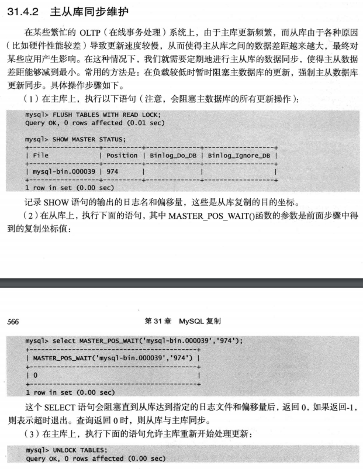

## 主从同步维护



## 查看复制状态

从库落后主库的时长

```sql
mysql> show slave status\G
Seconds_Behind_Master: 0
```

- [MySql Replication - slave lagging behind master](https://stackoverflow.com/questions/8547827/mysql-replication-slave-lagging-behind-master)

## 如何提供复制速度

多线程复制：`DATABASE`, `LOGICAL_CLOCK`。

```
slave_parallel_type
slave_parallel_workers
```

- [sysvar_slave_parallel_type](https://dev.mysql.com/doc/refman/5.7/en/replication-options-slave.html#sysvar_slave_parallel_type)
- [Mysql 5.7 主从复制的多线程复制配置方式](https://www.jianshu.com/p/a1ff89122266)

## 主从切换

确保所有从库都已执行完 Relay Log 中的内容。

```sql
STOP SLAVE IO_THREAD;
SHOW PROCESSLIST;
```

将 Slave1 重置为主数据库

```sql
STOP SLAVE;
RESET MASTER;
```

Slave1 需要确保已开启了 binlog，并且没有开启 `log-slave-updates`。

```cnf
[mysqld]
server-id = 2
log_bin = /var/log/mysql/mysql-bin.log
log_slave_updates = 0
```

将 Slave2 的主库切换为 Slave1。

```sql
STOP SLAVE;
CHANGE MASTER TO MASTER_HOST = '192.168.1.41';
START SLAVE ;
```

删除 Slave1 的 master.info 和 relay-log.info 文件，否则下次重启还是会按照从库启动。

```sh
rm /var/lib/mysql/master.info 
rm /var/lib/mysql/relay-log.info
```

- [Switching Masters During Failover](https://dev.mysql.com/doc/refman/5.7/en/replication-solutions-switch.html)

