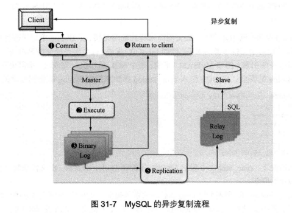
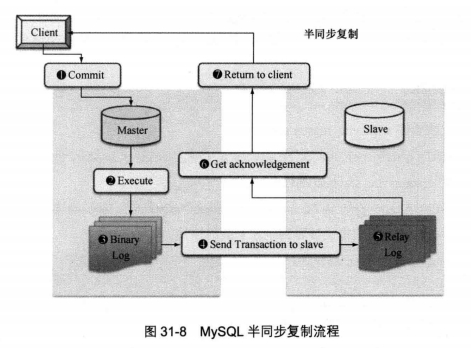

# 半同步复制

MySQL 的复制是异步的，主库和从库之间的数据存在一定的延迟，这样存在一个隐患：
当在主库上执行一个事务并提交成功，而从库尚未得到主库推送的 binlog 日志时，主库宕机了，
例如主库可能因磁盘损坏、内存故障等造成主库上该 binlog 丢失，此时从库就可能损失这个事务，从而造成主从不一致。
为了解决这个问题，引入了半同步复制机制。

异步复制时，主库执行完 `commit` 提交操作并将该操作写入 binlog 日志后即可返回成功给客户端，无需等待 binlog 传送给从库。



而半同步复制时，为了保证主库上的每一个 binlog 事务都能够可靠地复制到从库上，主库在每次事务成功提交后，并不马上反馈给客户端，
而是等待其中一个从库也接收到 binlog 事务并成功写入中继日志后，主库才返回操作成功给客户端。



半同步复制保证了事务成功提交后，至少有两份日志记录，一份在主库的 binlog 日志上，另一份在至少一个从库的中继日志 relay Log 上，
从而更进一步保证了数据的完整性。

半同步复制的“半”就体现在：虽然主库和从库的 binlog 日志是同步的，但是主库并不等待从库应用这部分日志就返回提交结果，这个步骤是异步的，
所以只能称为半同步，而不是完全的实时同步。

## Master

查看插件所在目录

```sql
show variables like "plugin%"
```

查看 semisync 插件是否存在

```
ls /usr/lib/mysql/plugin/
```

安装 semisync_master 插件

```sql
INSTALL PLUGIN rpl_semi_sync_master SONAME 'semisync_master.so';
```

查看已安装的插件

```sql
SHOW PLUGINS
```

启用半同步复制

```sql
SET GLOBAL rpl_semi_sync_master_enabled = 1
```

或修改配置文件

```cnf
[mysqld]
rpl_semi_sync_master_enabled = 1
```

查看系统变量

```sql
mysql> show variables like "rpl%";
```

查看运行状态

```sql
show status like "rpl%";
```

## Slave

安装 semisync_slave 插件

```sql
INSTALL PLUGIN rpl_semi_sync_slave SONAME 'semisync_slave.so';
```

查看已安装的插件

```sql
SHOW PLUGINS
```

启用半同步复制

```sql
SET GLOBAL rpl_semi_sync_slave_enabled = 1
```

重启 I/O 线程，否则不会切换到半同步复制。

```sql
STOP SLAVE IO_THREAD;
START SLAVE IO_THREAD;
```

或修改配置文件

```cnf
[mysqld]
rpl_semi_sync_slave_enabled=1
```

查看系统变量

```sql
show variables like "rpl%";
```

查看运行状态

```sql
show status like "rpl%";
```

## 参考文献

- [Semisynchronous Replication](https://dev.mysql.com/doc/refman/5.7/en/replication-semisync.html)
