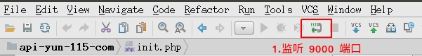
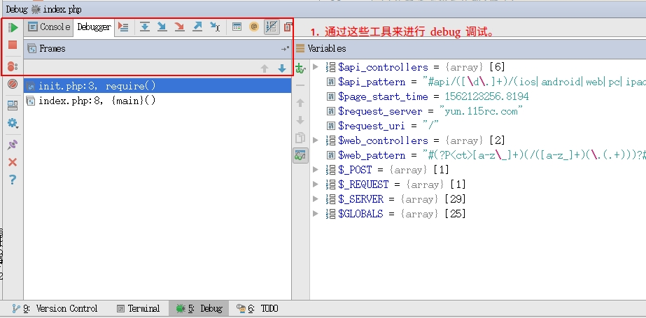

# Xdebug 使用方法

- [Docker环境](#Docker环境)
    - 1. 填写 PhpStorm 要监听的端口
    - 2. 新增一个 debug 服务配置
    - 3. 启动 PhpStorm 对端口的监听
    - 4. 配置服务器（Docker）上的 Xdebug
    - 5. 开始 debug
    - 6. 浏览器插件
- [灰度环境](#灰度环境)

## Docker环境

### 1. 填写 PhpStorm 要监听的端口

填写本地 PhpStorm 与 Docker 里 Xdebug 进行通讯的端口。只需填写一个未被占用的端口即可，本配置示例采用默认端口 9000。


注意，此时的 PhpStorm 还没有正式监听该端口，这里只是填写。

### 2. 新增一个 debug 服务配置

填写项目的域名、项目在本地与 Docker 里所在路径的对应关系。只需填写项目根目录的对应关系即可。


debug 服务配置的作用是为了保证本地与远程服务器上文件的一致性。因为服务器上文件的所在路径与本地的路径并非完全一致，而这里的 mapping 能让 PhpStorm 在本地找到正确的文件。

### 3. 启动 PhpStorm 对端口的监听

点击工具栏上的「小电话图标」开始监听 9000 端口。此时的 PhpStorm 就会等待服务器上的 Xdebug 发送信息过来，一旦收到信息 PhpStorm 就会进入 debug 模式。



使用 `netstat` 命令可以看到 9000 端口正在被监听中。

```sh
netstat -anp | grep :9000
tcp        0      0 0.0.0.0:9000            0.0.0.0:*               LISTEN      19785/java
```

以上步骤是本地需要做的所有

### 4. 配置服务器上 Xdebug

我们需要将本地的 IP、用于监听 Xdebug 的端口告知服务器上的 Xdebug，好让它能将调试信息发送到本地的 PhpStorm。将这些信息填写到 xdebug.ini 文件即可。

```php.ini
# /etc/php/7.2/fpm/conf.d/20-xdebug.ini 
zend_extension=xdebug.so
xdebug.remote_enable=1
xdebug.remote_host=192.168.1.229
xdebug.remote_port=9000
```

填写好以后，记得重启一下 php-fpm 服务。

```bash
# Docker 中重启 php-fpm 的方法
supervisorctl restart php7.2-fpm

# 非 Docker 的重启方法
service php7.2-fpm reload
```

### 5. 开始 debug

为了让 Xdebug 进入调试模式，在发起请求时我们需要使用几个特殊参数来触发。有三种方法进行触发，如下所示：

```bash
# 1. Cookie 添加 XDEBUG_SESSION
curl 'http://yun.115rc.com' -H "Cookie: XDEBUG_SESSION=1"

# 2. URL 添加 XDEBUG_SESSION_START
curl 'http://yun.115rc.com?XDEBUG_SESSION_START=1'
# 3. POST parameter 添加 XDEBUG_SESSION_START
curl 'http://yun.115rc.com' -d 'XDEBUG_SESSION_START=1'
```

此时本地的 PhpStorm 会接收到来自服务器上 Xdebug 发送过来的数据，随即进入 debug 模式。



### 6. 浏览器插件

每次都需要自行添加 XDEBUG_SESSION 等参数并不方便，可安装以下两个浏览器插件，安装好后就可以一键切换。

- [Xdebug Helper Chrome](https://chrome.google.com/webstore/detail/xdebug-helper/eadndfjplgieldjbigjakmdgkmoaaaoc)
- [Xdebug Helper Firefox](https://addons.mozilla.org/en-US/firefox/addon/xdebug-helper-for-firefox/)


## 灰度调试

灰度环境已经安装并配置好了 DBGp proxy，该工具配合 Xdebug 可用于安全的多用户远程调试。既然服务器环境已经准备好，我们只需要配置好本地环境即可。

在完成了上面本地调试环境配置的基础上，我们只需要完成以下两个步骤即可：

- 填写 DBGp proxy 配置信息；
- 向 DBGp proxy 注册本机信息（一键即可）；
- 配置站点信息；

### 1. 填写 DBGp proxy 配置信息

填写 DBGp proxy 配置信息是为了稍后向它注册本机信息而需要做的准备。


### 2. 注册本机信息

这一步实际上是将本地的 IP、所监听用于 Xdebug 的端口以及 IDE key 告知 DBGp proxy。因为它需要将 Xdebug 的信息发送到什么地方去。
