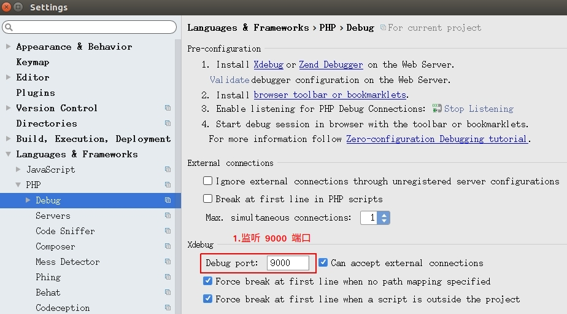

# Xdebug 使用方法

## 本地调试

### 1. 配置监听的端口

配置本地 PhpStorm 与服务器上 Xdebug 进行通讯的端口。默认端口是 9000，如有需要可自行修改。



此时的 PhpStorm 还没有正式监听该端口，这里只是填写。

### 2. 配置站点信息

填写项目域名、项目在本地与服务器上路径的映射关系。如果项目运行在 Docker 里，那么服务器上的项目路径就是该项目在 Docker 里的路径，填写项目根目录即可。


### 3. 开始监听

首先要在进行 debug 的文件上打好断点，然后点击工具栏上的小电话图标，此时 PhpStorm 就会开始监听 9000 端口，等待服务器上的 Xdebug 发送信息过来，一旦收到信息 PHPtorm 就会进入 debug 模式。


### 4. 配置服务器上 Xdebug

我们需要将本地的 IP、用于 Xdebug 的端口告知服务器上的 Xdebug，好让它能将调试信息发送到本地的 PhpStorm。将这些信息填写到 xdebug.ini 文件即可。

```php.ini
# /etc/php/7.2/fpm/conf.d/20-xdebug.ini 
zend_extension=xdebug.so
xdebug.remote_enable=1
xdebug.remote_host=192.168.1.229
xdebug.remote_port=9000
```

填写好以后，记得重启一下 php-fpm 服务。

```bash
# Docker 中重启 php-fpm 的方法
supervisorctl restart php7.2-fpm

# 非 Docker 的重启方法
service php7.2-fpm reload
```

### 5. 开始 debug

为了让 Xdebug 进入调试模式，在发起请求时我们可以使用一些特殊参数来触发。有三种方法进行触发，如下所示：

```bash
# Cookie 添加 XDEBUG_SESSION
curl 'http://yun.115rc.com' -H "Cookie: XDEBUG_SESSION=1"

# URL 添加 XDEBUG_SESSION_START
curl 'http://yun.115rc.com?XDEBUG_SESSION_START=1'
# POST parameter 添加 XDEBUG_SESSION_START
curl 'http://yun.115rc.com' -d 'XDEBUG_SESSION_START=1'
```

此时本地的 PhpStorm 会接收到服务器上 Xdebug 发送过来的数据，随即进入 debug 模式。


