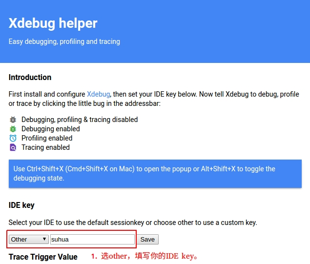

# 如何使用 Xdebug 调试灰度环境的项目

## 为什么

为什么需要灰度进行 Xdebug 调试？不得不说 tickdebug 已经能排查大部分的线上问题，而且使用方便。但是它也存在一些不足的地方：

- tickdebug 存在一些「奇怪的 bug」；
- tickdebug 必须接入才能使用；
- Xdebug 提供的信息更加丰富。如能实时观察到所有全局变量的变化情况等。

## 怎么做

下面就如何使用 PhpStorm 对灰度服务器上的 api.yun.115.com 项目进行远程 debug 进行详细说明。

前提条件：

- ping 172.16.200.200 能通；
- 该项目有部署在灰度服务器；
- 本地项目的代码跟灰度服务器上的代码一致；

步骤如下：

- [填写 PhpStorm 要监听的 debug 端口](#填写-phpstorm-要监听的-debug-端口)
- [填写 DBGp proxy 配置信息](#填写-dbgp-proxy-配置信息)
- [新增一个 debug 服务配置](#新增一个-debug-服务配置)
- [向 DBGp proxy 注册自己的 PhpStorm](#向-dbgp-proxy-注册自己的-phpstorm)
- [启动 PhpStorm 对 debug 端口的监听](#启动-phpstorm-对-debug-端口的监听)
- [开始 debug](#开始-debug)
- [浏览器插件](#浏览器插件)

## 填写 PhpStorm 要监听的 debug 端口

填写 PhpStorm 与灰度服务器上的 Xdebug 进行通讯的端口。填写一个未被占用的端口即可，本示例使用默认端口 9000。


## 填写 DBGp proxy 配置信息

DBGp proxy 已经装好在灰度服务器，它提供了一个安全且支持多用户 debug 的环境。我们只需要填写自己的 IDE key 即可，其他照抄。


## 新增一个 debug 服务配置

填写项目的域名、项目在灰度服务器上的目录路径，只需要填写根目录即可。


## 向 DBGp proxy 注册自己的 PhpStorm

点击一下菜单里的 Register IDE 即可完成注册。


若注册成功，IDE 会提示已注册成功信息，如下图：


## 启动 PhpStorm 对 debug 端口的监听

点击 PhpStorm 工具栏上的「打电话图标」，对 9000 端口进行监听。此时的 PhpStorm 就会等待灰度服务器上的 Xdebug 发送信息过来，一旦收到信息 PhpStorm 就会进入 debug 模式。


提示：如果你的 PhpStorm 没有显示该工具栏，可以勾选菜单 View > Toolbar 将它显示出来。

## 开始 debug

首先，要在你想进行 debug 的文件上打上断点。这里以在根目录的 init.php 文件为例打一个断点。


然后，通过在请求时加上 `XDEBUG_SESSION=IDE key` 参数触发灰度服务器的 Xdebug 进入 debug 模式。
  
```bash
curl 'http://yun.115.com' -H "Cookie: GIVEMEFIVE=1; XDEBUG_SESSION=suhua;"
```

注意，这里的 IDE key 必须要跟步骤 [填写 DBGp proxy 配置信息] 时所填写的一样。另外，在每次 debug 前最好再次执行一下 Register IDE。

## 浏览器插件

如果你想在浏览器中点一下按钮就可以开启或关闭调试，那么可以安装下面这些插件。

- [Xdebug Helper Chrome](https://chrome.google.com/webstore/detail/xdebug-helper/eadndfjplgieldjbigjakmdgkmoaaaoc)
- [Xdebug Helper Firefox](https://addons.mozilla.org/en-US/firefox/addon/xdebug-helper-for-firefox/)

配置方法



一键切换效果


这些插件实际上只是在你每次请求的时候，在 Cookie 里加上了 XDEBUG_SESSION=IDE key，实际上自己在使用 curl 的时候自行设置就可以了，插件只是便于操作。

## 参考

- [Remote Debugging](https://xdebug.org/docs/remote)
- [Multiuser Debugging via Xdebug Proxies](https://www.jetbrains.com/help/phpstorm/multiuser-debugging-via-xdebug-proxies.html)
- [Multi-user Debugging with Xdebug, DBGp and PHPStorm](https://tech-tamer.com/multi-user-debugging-with-xdebug-dbgp-and-phpstorm/)
- [Multi-User Debugging in PhpStorm](https://www.freecodecamp.org/news/multi-user-debugging-in-phpstorm-75ef628ed50f/)
- [PhpStorm, XDebug, and DBGp Proxy](https://www.cnblogs.com/jice/p/5064838.html)
